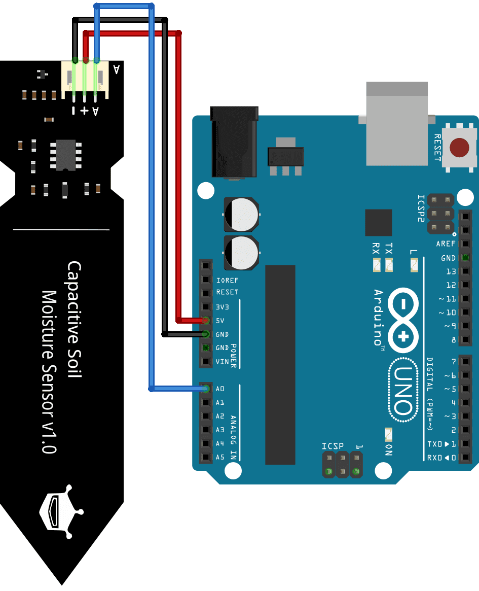

# Soil Moisture Monitoring System

This project is a real-time soil moisture monitoring system that uses an Arduino and a capacitive soil moisture sensor. The data is read from the sensor and sent to a Python script, which logs the data into a JSON file and visualizes it using Matplotlib.

## Features
- Reads soil moisture data from a sensor connected to an Arduino
- Sends data to a Python script via serial communication
- Saves the data into a JSON file without overwriting previous entries
- Displays real-time visualization of soil moisture levels

---

## Installation and Setup

### Required Libraries
Before running the Python script, install the necessary libraries using the following command:

```sh
pip install pyserial matplotlib
```

### Connecting the Hardware
- **Soil Moisture Sensor:** Connect the signal pin of the capacitive soil moisture sensor to **A0** on the Arduino.
- **Power:** Connect **VCC** to **5V** and **GND** to **GND** on the Arduino.

#### Wiring Diagram:
| Sensor Pin  | Arduino Pin |
|------------|------------|
| **VCC**    | **5V**      |
| **GND**    | **GND**     |
| **Signal** | **A0**      |

---

## Arduino Code
Upload the following code to your Arduino using the Arduino IDE:

```cpp
// Include the necessary libraries
#include <Arduino.h>

// Define the pin for the soil moisture sensor
const int soilMoisturePin = A0;

// Variable to store the sensor value
int soilMoistureValue = 0;

void setup() {
  // Initialize the serial communication
  Serial.begin(9600);
}

void loop() {
  // Read the analog value from the soil moisture sensor
  soilMoistureValue = analogRead(soilMoisturePin);

  // Print the sensor value to the Serial Monitor
  Serial.print("Soil Moisture Value: ");
  Serial.println(soilMoistureValue);

  // Add a short delay before the next reading
  delay(1000);
}
```

---

## Running the Python Script
1. Ensure the Arduino is connected via USB.
2. Identify the correct serial port (e.g., `COM3` on Windows, `/dev/ttyUSB0` on Linux/macOS).
3. Run the Python script using:

```sh
python soil_moisture_logger.py
```

---

## Output
### JSON Data Format
The data will be continuously appended to `soil_moisture_data.json` in the following format:

```json
[
    {
        "Date": "2025-03-11",
        "Time": "22:57:51",
        "Soil Moisture (%)": 44.18
    },
    {
        "Date": "2025-03-11",
        "Time": "22:57:52",
        "Soil Moisture (%)": 44.18
    }
]
```

### Real-time Plot
The script will generate a live-updating graph displaying the soil moisture percentage over time.

---

## Screenshot


---

## Troubleshooting
- **No data appearing in Python?** Ensure the correct COM port is set in `serial.Serial('COM3', 9600)`. Use the Arduino IDE's `Tools > Port` menu to check.
- **Graph not updating?** Make sure Matplotlib is installed properly and running in an interactive mode.
- **Incorrect moisture readings?** Adjust `DRY_VALUE` and `WET_VALUE` in the Python script based on calibration.

---

## Future Improvements
- Implement cloud-based logging for remote monitoring
- Add temperature and humidity sensors for better analysis
- Develop a GUI for better data visualization

---

## License
This project is open-source and free to use. Feel free to modify and improve it!

