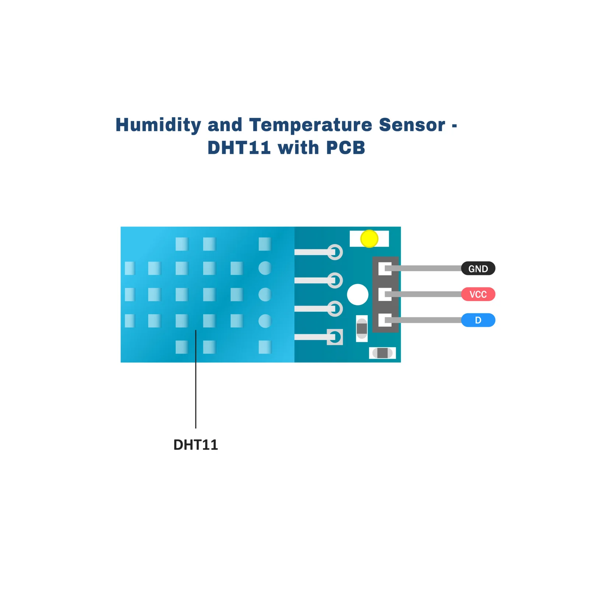
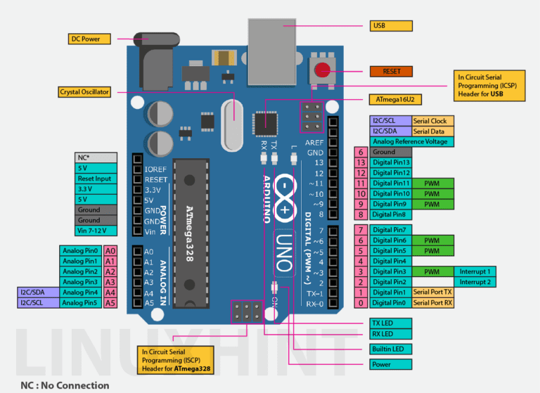
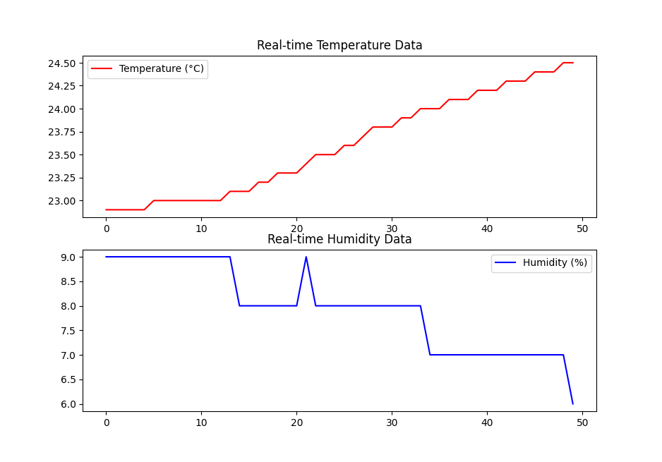
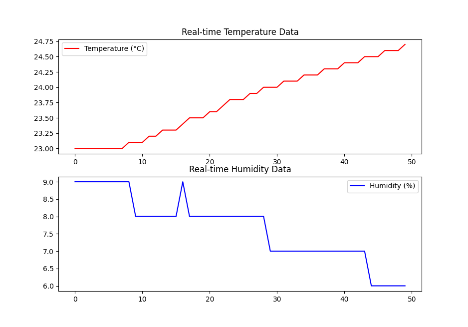

# Arduino

# DHT11 Temperature and Humidity Monitoring with Arduino and Python

## 📌 Project Overview
This project demonstrates how to use an **Arduino Uno** with a **DHT11 temperature and humidity sensor** to collect environmental data and visualize it in **real-time using Python and Matplotlib**. The sensor measures temperature (°C) and humidity (%) and sends the data to a computer via the serial port. A Python script then reads and plots the data dynamically.

## 📷 Screenshots
Below are some reference images to help you set up the project correctly:
- 
- 
- 
- 

---

## 🛠️ Hardware Requirements
- **Arduino Uno**
- **DHT11 Temperature & Humidity Sensor**
- **10KΩ Resistor** (for pull-up)
- **Jumper Wires**
- **USB Cable** (to connect Arduino to PC)
- **Computer** with **Arduino IDE** and **VS Code** installed

---

## 🔌 Wiring Diagram: Connecting the DHT11 to Arduino

| DHT11 Pin | Arduino Pin |
|-----------|------------|
| VCC       | 5V         |
| GND       | GND        |
| DATA      | D2         |
| 10KΩ Resistor | Between VCC & DATA |

Make sure to connect the **DATA pin of the DHT11 to Digital Pin 2** on the Arduino. The **10KΩ pull-up resistor** ensures reliable data transmission.

---

## 🖥️ Setting Up the Arduino IDE
### 1️⃣ Install the Required Libraries
1. Open **Arduino IDE**.
2. Go to **Sketch → Include Library → Manage Libraries**.
3. Search for **"DHT sensor library by Adafruit"** and install it.
4. Also install **"Adafruit Unified Sensor"** library.

### 2️⃣ Upload the Arduino Code
1. Connect your **Arduino Uno** to the computer via USB.
2. Open the Arduino IDE and paste the following code:

```c
#include <DHT.h>

#define DHTPIN 2      // DHT11 connected to Digital Pin 2
#define DHTTYPE DHT11
DHT dht(DHTPIN, DHTTYPE);

void setup() {
    Serial.begin(9600);
    dht.begin();
}

void loop() {
    float temperature = dht.readTemperature();
    float humidity = dht.readHumidity();
    if (isnan(temperature) || isnan(humidity)) {
        Serial.println("Error reading from DHT sensor!");
    } else {
        Serial.print(temperature);
        Serial.print(",");
        Serial.println(humidity);
    }
    delay(2000);
}
```

### 3️⃣ Upload Code to Arduino
1. Select **Tools → Board → Arduino Uno**.
2. Select the correct **COM port** under **Tools → Port**.
3. Click the **Upload** button (✓) to upload the code to the Arduino.

### 4️⃣ Open the Serial Monitor
- Go to **Tools → Serial Monitor**.
- Set baud rate to **9600**.
- You should see temperature and humidity readings appearing every 2 seconds.

---

## 🖥️ Setting Up Python in VS Code
### 1️⃣ Install Required Python Libraries
Ensure you have **Python** installed. Then, open **VS Code** and install the required libraries:

```bash
pip install pyserial matplotlib
```

### 2️⃣ Find Your Arduino Serial Port
- **Windows:** Open **Device Manager** → Ports (COM & LPT) → Note down your **COM port** (e.g., COM3).
- **Linux/macOS:** Run:

```bash
ls /dev/ttyUSB*
```

### 3️⃣ Run the Python Script
Create a new Python script and paste the following code:

```python
import serial
import matplotlib.pyplot as plt
import matplotlib.animation as animation

# Change 'COM3' to your Arduino's correct port
ser = serial.Serial('COM3', 9600, timeout=1)

temperature_data = []
humidity_data = []

def update(frame):
    line = ser.readline().decode().strip()
    if line:
        try:
            temp, hum = map(float, line.split(","))
            temperature_data.append(temp)
            humidity_data.append(hum)
            
            if len(temperature_data) > 50:
                temperature_data.pop(0)
                humidity_data.pop(0)
            
            ax1.clear()
            ax2.clear()
            
            ax1.plot(temperature_data, 'r-', label="Temperature (°C)")
            ax2.plot(humidity_data, 'b-', label="Humidity (%)")
            
            ax1.legend()
            ax2.legend()
        except ValueError:
            pass

fig, (ax1, ax2) = plt.subplots(2, 1, figsize=(6, 6))
ani = animation.FuncAnimation(fig, update, interval=1000)

plt.show()
ser.close()
```

### 4️⃣ Run the Python Script
```bash
python your_script.py
```

You should see a **real-time graph** displaying temperature and humidity data! 📊

---

## 🎯 Conclusion
Congratulations! 🎉 You have successfully:
✔️ Connected a **DHT11 sensor** to an **Arduino Uno**.
✔️ Read **temperature & humidity** and sent it via **serial communication**.
✔️ Used **Python & Matplotlib** to visualize real-time data.

This project is a great starting point for **IoT and environmental monitoring systems**! 🌍💡

---

## 📚 Further Improvements
Want to take this project further? Here are some ideas:
- Store sensor data in a **CSV file** for analysis.
- Upload data to a **cloud database**.
- Add an **OLED or LCD display** to show readings on the Arduino.
- Use a **web dashboard (Flask, Django, or Node.js)** to view data remotely.

---

## 💡 Troubleshooting
### ❌ No Data in Serial Monitor?
✔️ Ensure **DHT11 is wired correctly**.
✔️ Try using **a different digital pin (e.g., D3, D4)**.
✔️ Make sure you have the correct **COM port** selected.

### ❌ Python Script Not Receiving Data?
✔️ Check if **Arduino Serial Monitor is closed** (only one program can access the port at a time).
✔️ Ensure the correct **COM port** is set in Python.
✔️ Install required Python libraries with `pip install pyserial matplotlib`.

---

## 📜 License
This project is **open-source**. Feel free to modify and improve it!

---

🚀 *Happy Coding!*


 Arduino Anatolie Jentimir Repository
