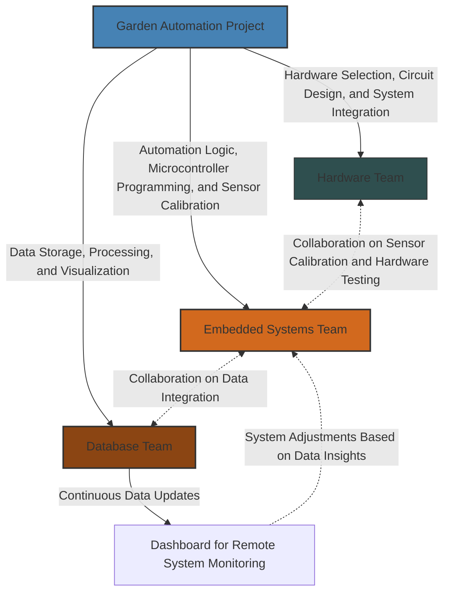

# 🌱 Self-Watering Garden Automation Project - BHCC STEM Club

The **Self-Watering Garden Automation Project** is a **project** developed by the **BHCC STEM Club** to design and implement an **automated plant watering system**. The project aims to create an efficient, **data-driven irrigation system**, starting with an **indoor prototype** before expanding to a **fully scalable outdoor solution**.

To ensure **structured development**, the project is divided into **three specialized teams**, each responsible for a particular aspect of the system:

## 🛠 **Hardware Team**

**Responsibilities:**

-   Select appropriate **sensors** (e.g., soil moisture sensors, temperature sensors) for monitoring environmental conditions.
-   Design and build **circuitry** for connecting the microcontroller, pumps, and actuators.
-   Ensure **hardware resilience** by creating a weatherproof **enclosure** for future outdoor deployment.
-   Use **Tinkercad** or similar tools for initial circuit simulations before moving to real-world assembly.

**Collaboration:**

-   Works closely with the **Embedded Systems Team** to test **sensor calibration** and ensure smooth communication between the hardware and software.

---

## 💻 **Embedded Systems Team**

**Responsibilities:**

-   Write firmware to **read sensor data** from soil moisture, humidity, and temperature sensors.
-   Develop the logic for **triggering water valves and pumps** based on sensor thresholds.
-   Optimize **power consumption** and ensure the system is **responsive and reliable**.
-   Use **Tinkercad** for simulating code before moving to real microcontrollers (e.g., Arduino, ESP32).

**Collaboration:**

-   Works closely with the **Hardware Team** to ensure accurate **sensor readings** and **hardware-software integration**.
-   Communicates with the **Database Team** to **send sensor data** for storage and further analysis.

---

## 🗄 **Database Team**

**Responsibilities:**

-   Store and manage sensor data in a **cloud database** for long-term tracking.
-   Create **real-time monitoring dashboards** for visualizing soil moisture levels, temperature trends, and system activity.
-   Implement **data logging** to analyze historical trends and improve watering efficiency.
-   Develop an **API** to allow external applications (e.g., mobile apps, web dashboards) to access the system’s data.

**Collaboration:**

-   Works with the **Embedded Systems Team** to ensure a **uninterrupted data flow** from the microcontroller to the cloud.
-   Integrates with a **Dashboard Team** (if expanded) to allow **remote monitoring and control**.

---

## 📊 **Dashboard for Remote System Monitoring**

The **dashboard** acts as the main interface for monitoring the automated garden system remotely. It allows users to:

-   View **real-time sensor data** (moisture, temperature, pump activity).
-   Receive **alerts and notifications** if soil moisture levels are too low or if system malfunctions occur.

**Collaboration:**

-   The **Database Team** sends sensor data to the dashboard for **real-time visualization**.
-   The **Embedded Systems Team** have access to **data insights** for future system adjustments.

---

### 🔄 **How Everything Connects**

1. **The Hardware Team** builds the physical infrastructure and ensures sensors work correctly.
2. **The Embedded Systems Team** programs the logic for automation and sends data to storage.
3. **The Database Team** stores the collected data and enables remote access via a dashboard.
4. **The Dashboard allows users** to monitor the system health remotely.

---

## 🌿 Project Flowchart

## Reference Material

-   [Tinkercad](https://www.tinkercad.com/): Free app for 3D design, electronics, and coding (use for prototyping, circuit design and code testing).

## 🛠 Contribution Guidelines

Every BHCC STEM Club member is welcome to contribute to the **Self-Watering Garden Automation Project**! To keep our development organized, please follow these guidelines when making commits and pull requests.

---

### **📌 Contribution Workflow**

1. **Fork the repository** and create a new branch (`feature/xyz`, `fix/xyz`).
2. **Follow commit message conventions** (see below).
3. **Ensure your changes work** before pushing.
4. **Submit a pull request (PR)** with a **clear title and description**.
5. **Request a review** and make adjustments if needed.

---

### **📝 Commit Message Guidelines**

Use a structured commit message format:

**Example:**

-   `feat: add soil moisture sensor integration`
-   `fix: resolve issue with water pump activation`
-   `docs: update README with project setup instructions`

### **Commit Types**

| Type       | Purpose                                      |
| ---------- | -------------------------------------------- |
| `feat`     | New feature                                  |
| `fix`      | Bug fix                                      |
| `docs`     | Documentation updates                        |
| `chore`    | General updates (e.g., dependencies, config) |
| `refactor` | Code improvements without behavior changes   |

---

### **🔀 Pull Request Guidelines**

Before submitting a PR:  
✅ Ensure the title follows the commit format (`feat: add XYZ`).  
✅ Provide a **brief description** of the changes.  
✅ Reference any related issues (e.g., `Closes #42`).  
✅ Keep PRs **focused on one task** to make reviews easier.

**Example PR Description:**

**Summary**

Added soil moisture sensor support to automate watering based on threshold levels.

**Changes**

-   Integrated soil moisture sensor
-   Added logic to trigger water pump
-   Updated README with sensor setup instructions

**References**

Closes #42

---

## **📋 Best Practices**

✅ Use **feature branches** instead of committing to `main`.  
✅ Keep commits **small and meaningful**.  
✅ If unsure, ask for feedback before submitting large changes ((contact relevant club group members, see list below)).

For questions or discussions, open an **issue** or post in the **GitHub Discussions** tab.

---

## Group Members

-   ...
-   ...
-   ...
-   ...
